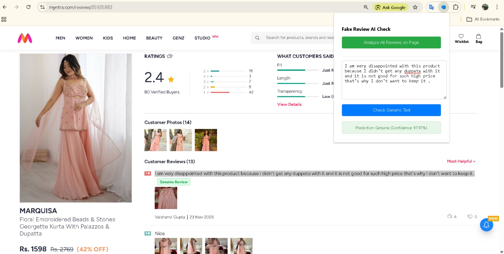

# FakeReview-AI Chrome Extension - Detailed Technical Report

## 1. Executive Summary
**FakeReview-AI** is a browser-based tool designed to combat the proliferation of fraudulent product reviews on e-commerce platforms. By leveraging a **Hybrid Machine Learning Engine** (Deep Learning + Behavioral Analysis), the system analyzes text patterns and user metadata to accurately flag suspicious reviews in real-time. This report outlines the technical architecture, feature set, and operational workflow of the system.

## 2. System Architecture
The project follows a **Microservices Architecture**:
- **Frontend (Client):** Chrome Extension (Manifest V3) responsible for DOM manipulation, data extraction, and user interaction.
- **Backend (Server):** Python FastAPI application hosting the ML models.
- **ML Engine:** DistilBERT (Transformer model) optimized with ONNX Runtime for sub-millisecond inference, combined with heuristic algorithms for metadata scoring.

## 3. Core Features & Visual Demonstration

### A. Real-Time Analysis with Badges
In-page analysis injects clear visual indicators next to each review. The system automatically detects review containers on major e-commerce platforms.

**Amazon Integration (Green/Red Badges):**

**Flipkart Integration:**

**Myntra Integration:**

### B. Popup Dashboard
The main extension popup allows users to scan an entire page with one click or analyze generic text.

### C. Manual Analysis Mode (Text Selection)
For use on any website (Universal Parser), users can highlight text and click the 🔎 magnifier icon for an instant analysis card. This feature ensures compatibility with non-standard sites like brand stores (e.g., Noise).

**Manual Selector Tool:**

**Analysis Result Card:**

**Universal Parser in Action (Brand Site):**
.jpeg)

## 4. Operational Workflow (Logic Flow)
The extension follows a robust fallback strategy to ensure maximum compatibility. The system first attempts precise DOM selection; if that fails, it switches to a universal parser, ensuring reviews are always detected.

### Logic Breakdown:
1.  **Initiation:** User clicks "Analyze All Reviews".
2.  **Site Detection:** Checks if the site is Amazon, Flipkart, or Myntra to load specific config.
3.  **Extraction & Validation:**
    *   **Config Success:** Uses specific selectors.
    *   **Fallback:** If selectors fail, the **Universal Parser** scans the DOM for review-like structures.
4.  **Final State:**
    *   **Success:** Results displayed via badges.
    *   **Manual Mode:** Any text can be manually checked as a backup.

## 5. Technology Stack
- **Frontend:** HTML5, CSS3, JavaScript (ES6+), Chrome Extension API (Manifest V3)
- **Backend:** Python 3.9, FastAPI, Uvicorn
- **AI/ML:** PyTorch, Transformers (Hugging Face), ONNX Runtime, Scikit-learn
- **Data Handling:** Pandas, NumPy
