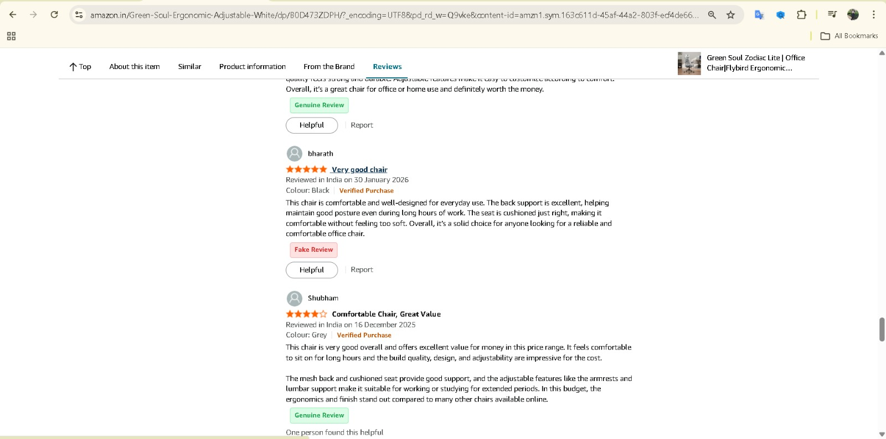
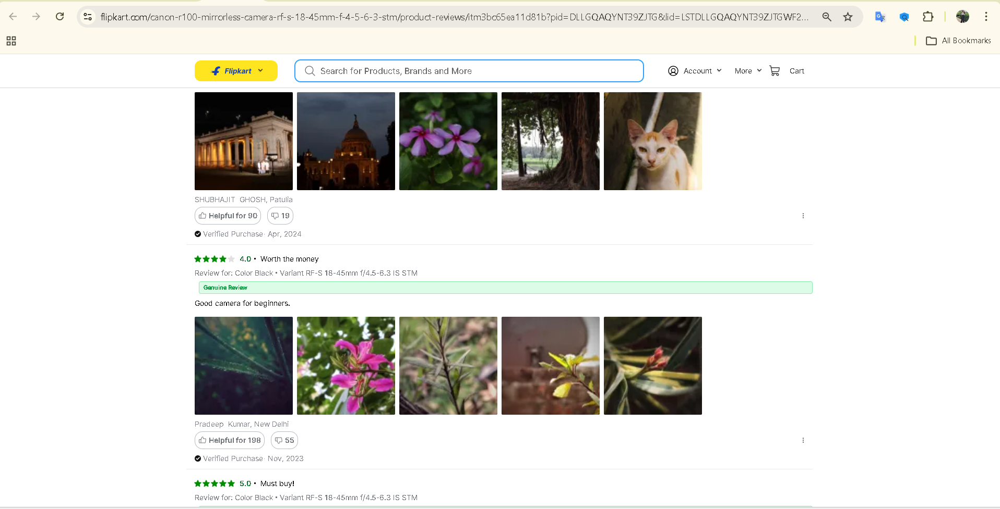
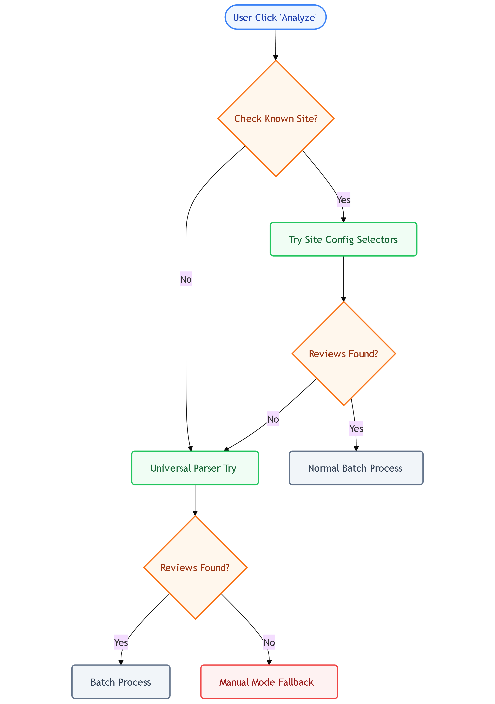

# FakeReview-AI Chrome Extension 🕵️‍♂️🚫

**FakeReview-AI** is a comprehensive system designed to detect fraudulent product reviews in E-Commerce environments. It features a powerful **Chrome Extension** backed by a hybrid machine learning backend that combines deep learning (DistilBERT) with behavioral analysis.


## 🚀 Features

### 🌐 Chrome Extension Capabilities
- **Real-Time Analysis**: Automatically operates on major e-commerce platforms like **Amazon**, **Flipkart**, and **Myntra**.
- **Batch Processing**: "Analyze All" button to scan an entire product review page instantly.
- **Manual Mode**: precise tool - select *any text* on *any website*, click the magnifier 🔎, and get an instant authenticity report.
- **Visual Indicators**: Clear, color-coded badges (✅ Genuine / ⚠️ Fake) injected directly next to reviews.

### 📸 Screenshots

| Amazon Integration | Flipkart Integration | Myntra Integration |
|:---:|:---:|:---:|
|  |  |  |

### 🛠️ Manual Mode (Universal Parser)
Analyze text on any website using our floating magnifier tool:


### 🧠 Core Technology
- **Hybrid Analysis Engine**: Merges **Deep Learning (DistilBERT)** for text content analysis with **Behavioral Heuristics** (user patterns).
- **Microservices Architecture**: Built with **FastAPI** for high-performance, real-time inference.
- **Behavioral Scoring**: Analyzes metadata such as review frequency, rating deviation, verified purchase status, and account age.

## 🔄 How It Works (Logic Flow)
The system follows a robust fallback strategy to ensure maximum compatibility:



1.  **Site Detection:** Automatically identifies if you are on a supported platform.
2.  **Intelligent Selection:** Attempts to use pre-configured selectors.
3.  **Automatic Fallback:** Switches to a **Universal Parser** if site structure changes.
4.  **Manual Override:** Always available as a powerful backup tool.

## 📂 Project Structure

```bash
FakeReview-AI/
├── api/                 # FastAPI application (Backend)
│   ├── main.py          # API Entry point
│   └── schema.py        # Pydantic models
├── chrome_extension/    # Browser Extension Source Code
│   ├── manifest.json    # Extension Manifest
│   ├── content.js       # Page Interaction Logic
│   ├── background.js    # Background Service Worker
│   └── popup.html       # Extension Popup UI
├── behavior/            # Behavioral analysis logic
├── models/              # Trained models (DistilBERT ONNX)
├── docs/assets/         # Screenshots and Project Images
├── testing/             # Evaluation scripts
├── training/            # Model training scripts
└── requirements.txt     # Python dependencies
```

## 📦 Installation Guide

### Backend Setup (Required)
1. **Clone the repository**
   ```bash
   git clone https://github.com/Tech-Anshika/FakeReview-AI-chrome-extension.git
   cd FakeReview-AI
   ```

2. **Install Dependencies**
   ```bash
   pip install -r requirements.txt
   ```

3. **Start the API Server**
   ```bash
   uvicorn api.main:app --reload
   ```
   *The backend must be running locally (`http://127.0.0.1:8000`) for the extension to work.*

### 🐳 Run with Docker (Alternative)
If you have Docker installed, you can start the backend with a single command:

1. **Build and Run:**
   ```bash
   docker-compose up --build
   ```
   *The API will be available at `http://localhost:8000`, which matches your extension's configuration.*

### Chrome Extension Setup
1. Open Google Chrome and navigate to `chrome://extensions/`.
2. Enable **Developer mode** (toggle in the top-right corner).
3. Click **Load unpacked**.
4. Select the `chrome_extension` folder from this project directory.
5. The **FakeReview-AI** icon will appear in your toolbar!

## 🤝 Contributing
Contributions are welcome! Please open an issue or submit a pull request.
